# 📐 Kumpulan Diagram — Bab 4.2 Perancangan Sistem
## SPK Penentuan Calon Peserta OSN | Hybrid AHP-SAW

> [!TIP]
> **Cara menggunakan diagram ini:**
> 1. Copy kode Mermaid di bawah
> 2. Buka [mermaid.live](https://mermaid.live) di browser
> 3. Paste kode → diagram langsung muncul
> 4. Klik **Export** → Download sebagai PNG
> 5. Masukkan gambar PNG ke dokumen Word/Skripsi
>
> Atau gunakan kode ini sebagai **panduan** untuk menggambar ulang di draw.io

---

## 1. Use Case Diagram

**Penjelasan**: Menggambarkan interaksi antara aktor (Admin) dengan fitur-fitur utama sistem SPK.

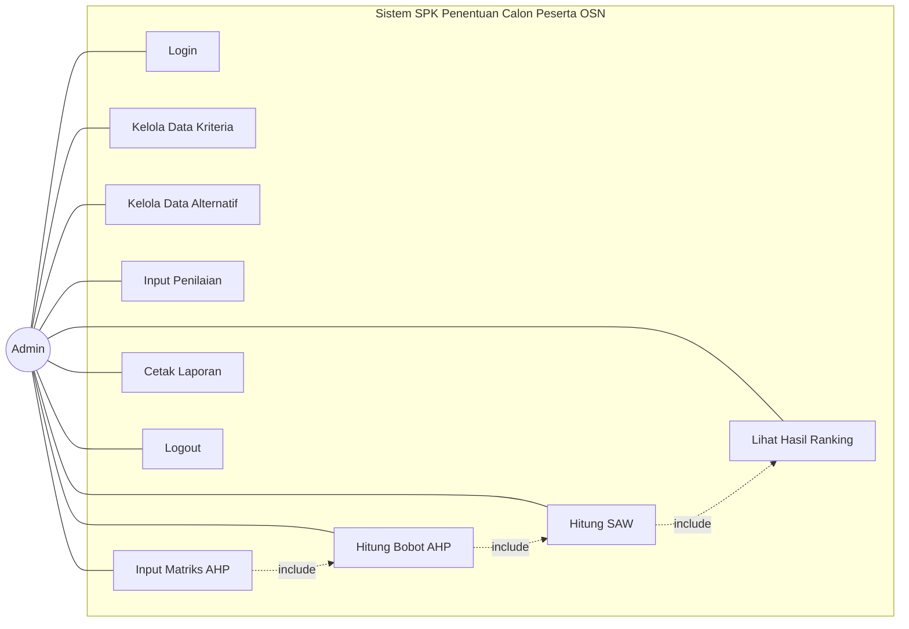

### Deskripsi Use Case:

| No | Use Case | Deskripsi |
|---|---|---|
| UC1 | Login | Admin memasukkan username dan password untuk masuk ke sistem |
| UC2 | Kelola Data Kriteria | Admin dapat melihat, menambah, mengubah, dan menghapus data kriteria penilaian (C1-C5) |
| UC3 | Kelola Data Alternatif | Admin dapat melihat, menambah, mengubah, dan menghapus data siswa calon peserta OSN |
| UC4 | Input Penilaian | Admin memasukkan nilai setiap siswa pada setiap kriteria (C1-C5) |
| UC5 | Input Matriks AHP | Admin memasukkan nilai perbandingan berpasangan antar kriteria berdasarkan kuesioner Wakasek |
| UC6 | Hitung Bobot AHP | Sistem menghitung normalisasi, eigenvector, CI, dan CR untuk menghasilkan bobot kriteria |
| UC7 | Hitung SAW | Sistem menghitung normalisasi matriks keputusan, nilai preferensi (Vi), dan ranking per bidang OSN |
| UC8 | Lihat Hasil Ranking | Admin melihat hasil perangkingan 5 siswa terbaik per bidang OSN (IPA, IPS, Matematika) |
| UC9 | Cetak Laporan | Admin mencetak/export hasil ranking dalam format PDF |
| UC10 | Logout | Admin keluar dari sistem |

---

## 2. Activity Diagram

### 2.1 Activity Diagram — Login

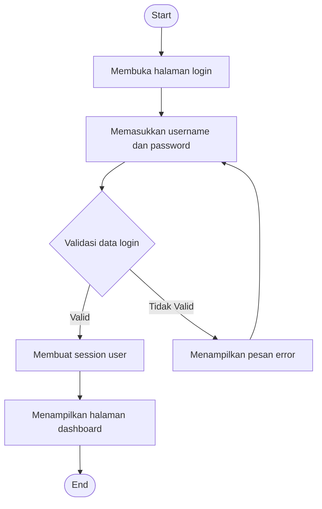

### 2.2 Activity Diagram — Kelola Data Siswa (Alternatif)

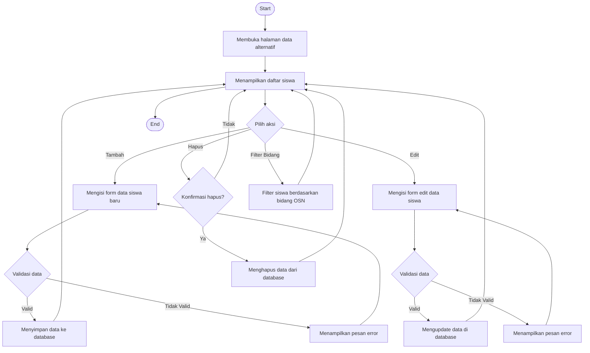

### 2.3 Activity Diagram — Input Penilaian

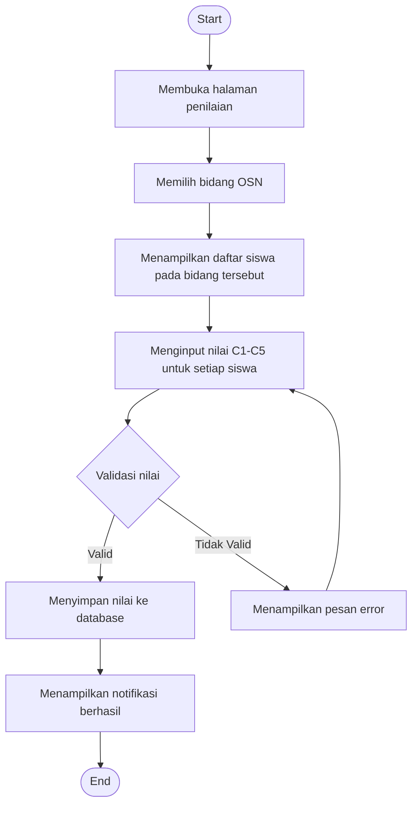

### 2.4 Activity Diagram — Proses Perhitungan AHP-SAW

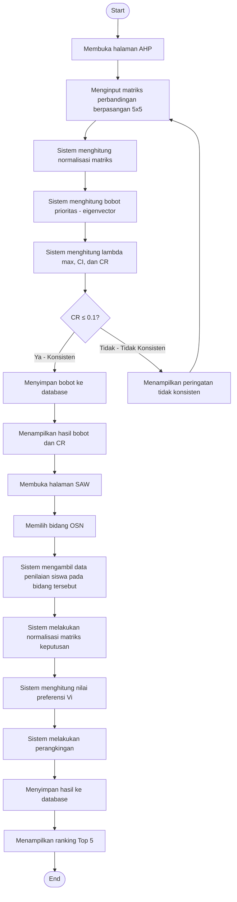

### 2.5 Activity Diagram — Cetak Laporan

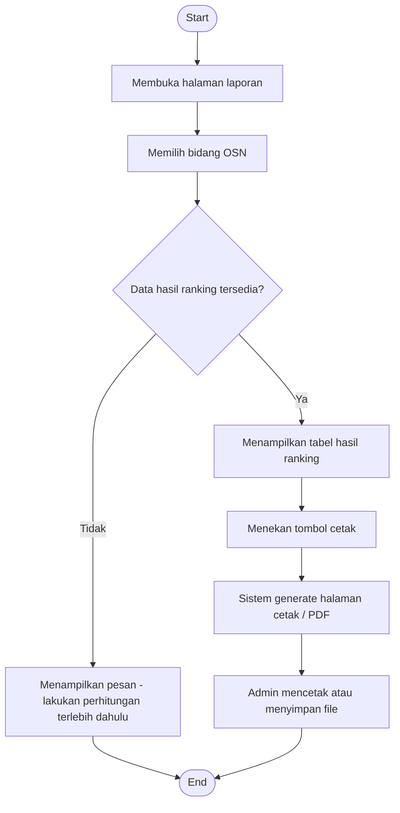

---

## 3. Sequence Diagram

### 3.1 Sequence Diagram — Login

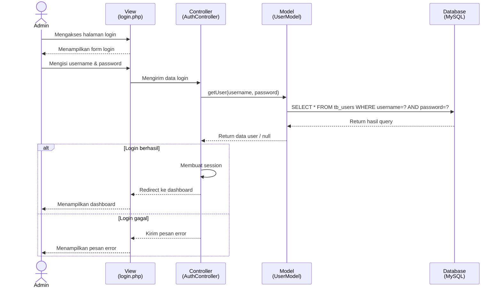

### 3.2 Sequence Diagram — Proses Perhitungan AHP

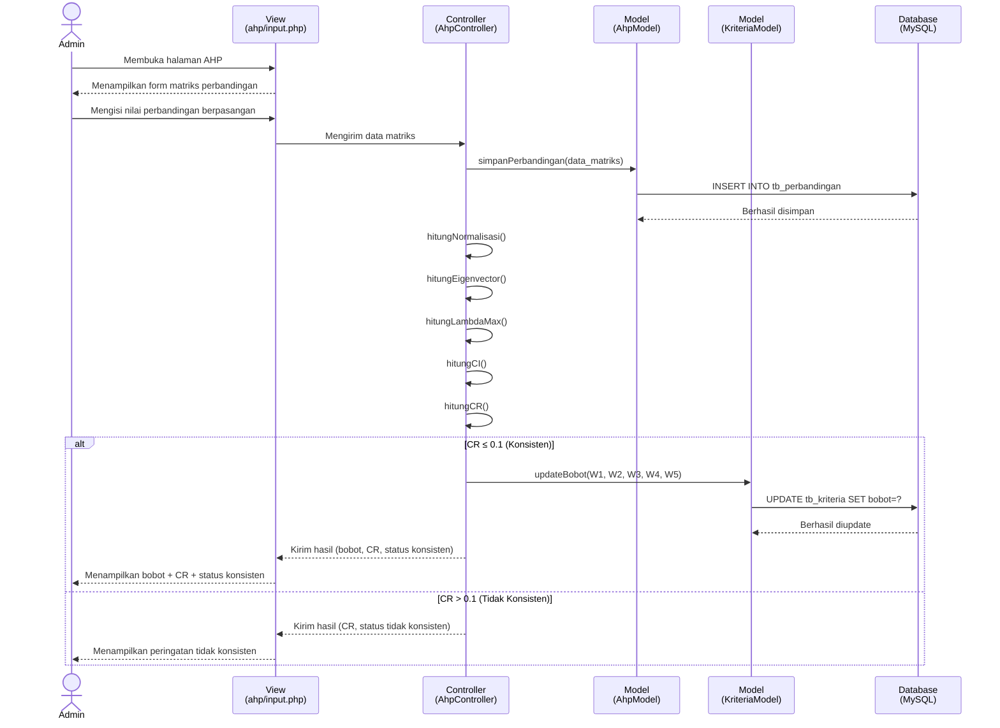

### 3.3 Sequence Diagram — Proses Perhitungan SAW

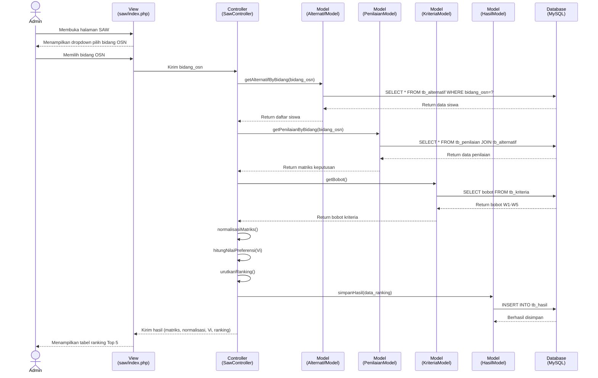

---

## 4. Class Diagram

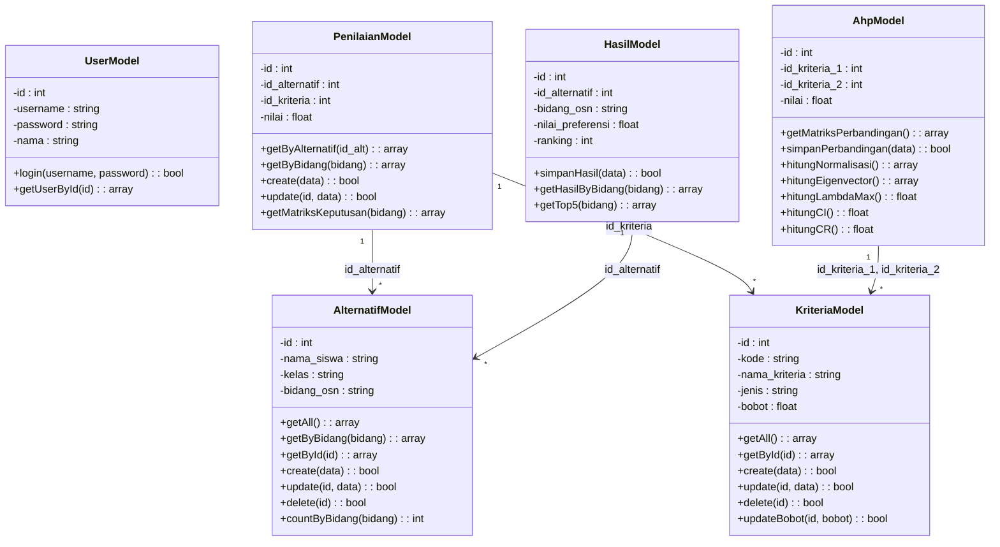

---

## 5. Entity Relationship Diagram (ERD)

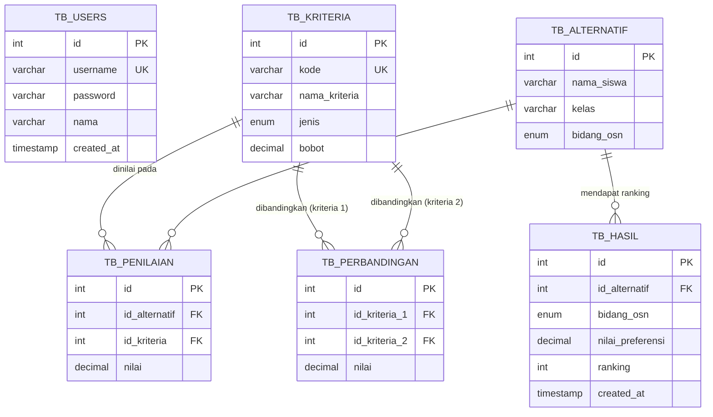

---

## 6. Flowchart Algoritma AHP-SAW

### 6.1 Flowchart AHP (Pembobotan Kriteria)

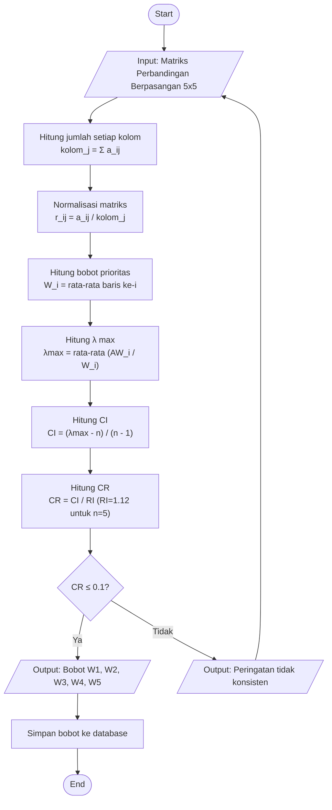

### 6.2 Flowchart SAW (Perangkingan per Bidang)

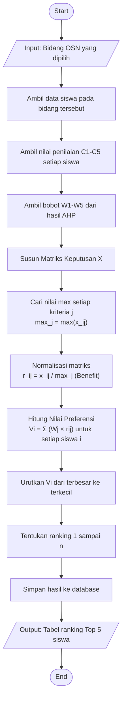

---

## 📋 Checklist Diagram untuk Bab 4

| No | Diagram | Sub-bab | Status |
|---|---|---|---|
| 1 | Use Case Diagram | 4.2.3a | ☐ |
| 2 | Activity Diagram — Login | 4.2.3b | ☐ |
| 3 | Activity Diagram — Kelola Siswa | 4.2.3b | ☐ |
| 4 | Activity Diagram — Input Penilaian | 4.2.3b | ☐ |
| 5 | Activity Diagram — Proses AHP-SAW | 4.2.3b | ☐ |
| 6 | Activity Diagram — Cetak Laporan | 4.2.3b | ☐ |
| 7 | Sequence Diagram — Login | 4.2.3c | ☐ |
| 8 | Sequence Diagram — Proses AHP | 4.2.3c | ☐ |
| 9 | Sequence Diagram — Proses SAW | 4.2.3c | ☐ |
| 10 | Class Diagram | 4.2.3d | ☐ |
| 11 | ERD | 4.2.4 | ☐ |
| 12 | Flowchart AHP | 4.2.6 | ☐ |
| 13 | Flowchart SAW | 4.2.6 | ☐ |

> [!NOTE]
> **Total: 13 diagram** yang perlu dirender menjadi gambar dan dimasukkan ke dokumen skripsi.
>
> **Cara tercepat:**
> 1. Buka [mermaid.live](https://mermaid.live)
> 2. Paste kode Mermaid dari dokumen ini satu per satu
> 3. Export sebagai PNG
> 4. Masukkan ke Word dengan caption: *"Gambar 4.x [Nama Diagram]"*
